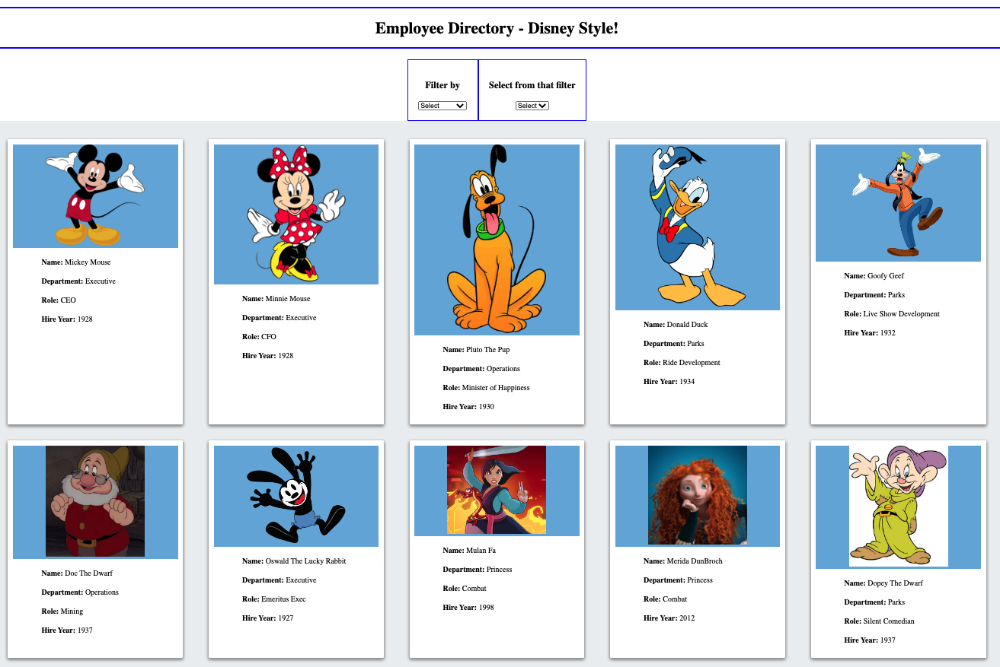
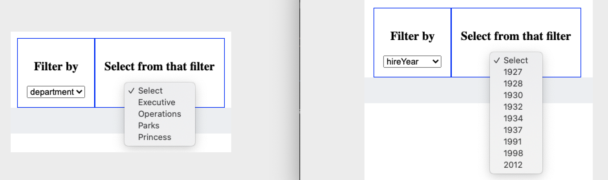
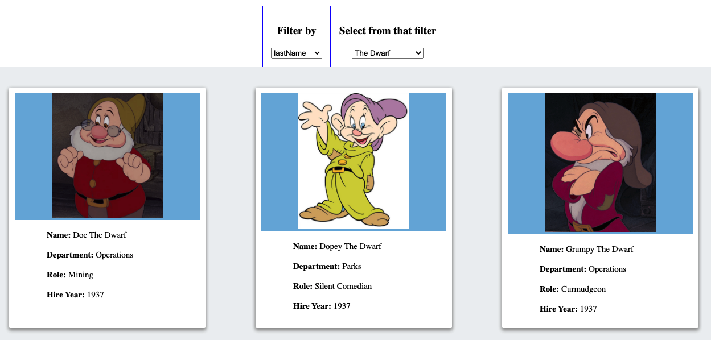
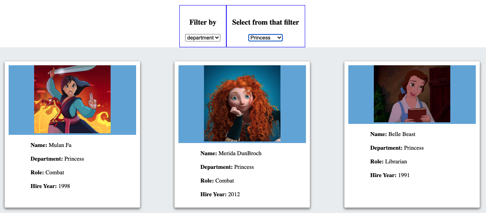

# Employee Directory with React!

## Deployed Website:
### [https://jpbrickhouse.github.io/employeedirectory/](https://jpbrickhouse.github.io/employeedirectory/)

## DESCRIPTION
A dynamic React application, allowing users to parse through an entire employee directory based upon multiple filters simultaneously.

## SCREENSHOTS
### Entire employee directory displayed at once

### Example Filters

### Example Filter - Last Name

### Example Filter - Department

## TABLE OF CONTENTS
* [Installation](#installation)
* [Usage](#usage)
* [License](#license)
* [Contributing](#contributing)
* [Retrospective](#retrospective)

## INSTALLATION
- No installation is required, as the user can simply visit the deployed application link: [https://jpbrickhouse.github.io/employeedirectory/](https://jpbrickhouse.github.io/employeedirectory/)
- However, if the user wishes to investigate the code locally, the following steps should be performed:
    - Clone the repo for use on your local machine
    - Use the command line to locate the cloned repo and make it your current directory
    - Type `npm install` in the command line
    - This will install the necessary node module packages and dependencies
    - Under the assumption that the user has MongoDB previously installed and/or running, no further installation is required

## USAGE
- To run the application locally...
    - Use the command line to locate the cloned repo and make it your current directory
    - Simply type `npm start` in the command line
    - This will open a localhost connection on your default browser, wherein the React application will run
- To run the application online, please visit the deployed link: [https://jpbrickhouse.github.io/employeedirectory/](https://jpbrickhouse.github.io/employeedirectory/)
- Application functionality is identical whether you are running the server locally or visiting the deployed link:
    - After arriving at the landing page, users will see the following:
        - Dropdown filters
        - The entire employee directory as a grid/table of cards, wherein each employee has all their information displayed within an individual card
    - Users can select the dropdown filters to parse through the employee directory
    - The filters are sorted alphabetically/numerically, and dynamically interact with one another based on user selection
    - The cards displayed are a subset of the entire directory, and are based upon the filter selections

## LICENSE
License: MIT License 
[https://opensource.org/licenses/MIT](https://opensource.org/licenses/MIT)

## CONTRIBUTING
[https://github.com/JPBrickhouse](https://github.com/JPBrickhouse)

## RETROSPECTIVE
"Never tell people how to do things. Tell them what to do and they will surprise you with their ingenuity." - General George Patton

No "starter" code was provided for this assignment, and the acceptance criteria was as follows:
- Given a table of random users, when the user loads the page, a table of employees should render
- The user should be able to Sort the table by at least one category and filter the users by at least one property

To generate "random" users, I quickly created a javascript array of objects, each of which contained employee data (based on famous Disney characters).

The entire employee directory gets displayed as a grid/table of cards, wherein each employee has all their information contained within an individual card.

From there, I built multiple filters (which are sorted alphabetically/numerically) that allow the user to dynamically parse through the data and display only a subset of cards.

Styling was not a primary focus for this assignment, so the layout is admittedly plain.

Instead, the primary focus was understanding React components, state (callback functions), and rendering capabilities.

While initially challenging, this assignment is only the first step to unlocking the power of React!
